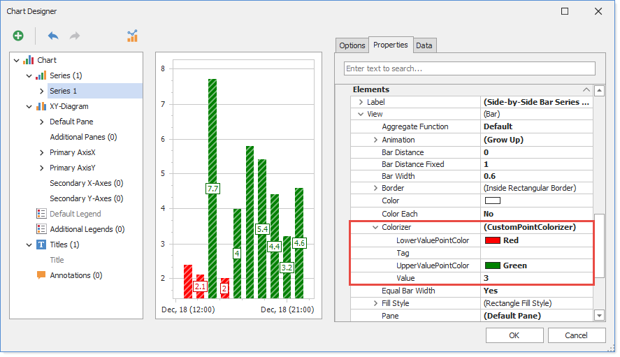

<!-- default badges list -->

<!-- default badges end -->

# Chart for WinForms - Create a Model for a Custom Chart Element

This example illustrates how to create and register a model (the **CustomPointColorizerModel** class in this example) for a custom chart element (the **CustomPointColorizer** class in this example).

A user configures *chart element model* properties when modifying *chart element* properties in the Chart Designer. Model changes apply to a corresponding chart element when the user clicks **OK**. The Chart Control provides models for existing chart elements. If you create a custom element (a colorizer in this example), you should create and register a model for this element to allow users to edit its options.

See the [Chart Designer for End-Users](https://docs.devexpress.com/WindowsForms/114127/controls-and-libraries/chart-control/end-user-features/chart-designer-for-end-users) help document for more information.

## Files to Review

* [Form1.cs](./CS/CustomChartElementModel/Form1.cs) (VB: [Form1.vb](./VB/CustomChartElementModel/Form1.vb))
* [CustomColorizerEditor.cs](./CS/CustomChartElementModel/CustomColorizerEditor.cs) (VB: [CustomColorizerEditor.vb](./VB/CustomChartElementModel/CustomColorizerEditor.vb))
<!-- default file list end -->

## Documentation

- [Chart Designer for End Users](https://docs.devexpress.com/WindowsForms/114127/controls-and-libraries/chart-control/end-user-features/chart-designer-for-end-users)
- [ChartDesigner.RegisterCustomModelType(Type, Type) Method](https://docs.devexpress.com/WindowsForms/DevExpress.XtraCharts.Designer.ChartDesigner.RegisterCustomModelType(System.Type-System.Type))
- [ChartColorizerBaseModel](https://docs.devexpress.com/WindowsForms/DevExpress.XtraCharts.Designer.ChartColorizerBaseModel?p=netframework)

## Does this example address your development requirements/objectives?

 

(you will be redirected to DevExpress.com to submit your response)
<!-- feedback end -->
